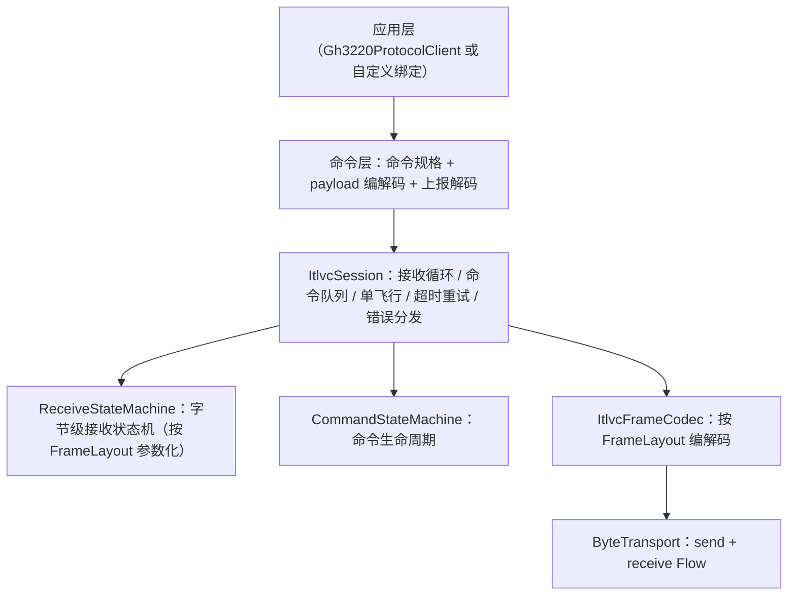

# ITLVC 通用通信协议框架（ble-itlvc）

通用底层通信状态机框架，零芯片语义，可复用于任何 ITLVC 帧协议（GH3220 / GH3036 / GH3300 等）。

## 分层结构



## 换协议复用步骤

1. 提供 `FrameLayout`（I/T/L/V/C 各字段宽度、校验算法或 null）。
2. 提供 `CommandSpec` 命令表（type / 超时 / 重试 / 透传权限）。
3. 提供 `ByteTransport` 实现（BLE Notify 适配器、串口适配器等）。
4. 复用 `ItlvcSession` / `ReceiveStateMachine` / `CommandStateMachine` / 超时 / 错误机制，无需改动框架。

## 接收状态机

- 字节级增量解析：`WAIT_HEADER → WAIT_TYPE → WAIT_LEN → WAIT_VALUE →（可选）WAIT_CHECKSUM → 产出帧`。
- 天然支持：一次 Notify 多帧（粘包）、一帧跨多次 Notify（分片）、坏帧/CRC 失败重同步。
- 帧内超时（默认 100ms）丢弃半帧并回到 `WAIT_HEADER`。

## 命令生命周期

- 单飞行请求 + 队列：同一时刻仅一个请求等待响应，按 T 匹配队首。
- `CREATED → PENDING_SEND → AWAITING_RESPONSE → COMPLETED / TIMED_OUT → FAILED`。
- 响应超时（默认 1000ms）按配置重试，超过重试次数以 `CommandError.Timeout` 结束。
- 主动上报（如 0x08/09/0A/0B/16/2A）走 report handler，不阻塞请求队列。

## 错误机制

| 层级 | 类型 | 说明 |
| --- | --- | --- |
| 帧层 | `FrameError` | CrcMismatch / InvalidHeader / LengthOverflow / TruncatedFrame |
| 命令层 | `CommandError` | Timeout / DeviceError / Unsupported / Busy / InvalidParam / CrcFail / Unknown |
| 解析层 | `ParseError` | payload 结构非法、rawdata 位流越界 |
| 传输层 | `TransportError` | 发送失败、通道关闭 |

## 校验机制

- `Checksum` 接口可插拔；`Crc8` 为默认实现（poly 0x07、初值 0xFF、不反射、无最终异或，与设备端表一致）。
- `FrameLayout.checksum = null` 时不做校验，载荷收满即产出帧，不产生 `CrcMismatch`。

## 底层读写模型（BLE Notify 驱动）

- 接收：RX Notify 回调 → `Flow<ByteArray>` → 会话接收协程逐块喂入接收状态机；不轮询读。
- 发送：`ByteTransport.send(bytes)` 串行写入 TX 特征；`mtu` 供分片参考。
- 测试：`InMemoryTransport` 注入分片/粘包/断连场景。

## NotifyTransport 接入指南（BLE 接入期）

- `NotifyTransport(notifyFlow, writer, mtu)` 实现 `ByteTransport`：接收 = BLE 连接层把 RX 特征
  Notify 回调发射为 `Flow<ByteArray>`；发送 = 委托 `writer` 写 TX 特征。
- 装配示例（连接层接线属 Phase 6，此处为框架侧契约）：

```kotlin
val transport = NotifyTransport(bleNotifyFlow, bleWriter, mtu = 240)
session.attach(transport, scope)
client.attach()
```

- 会话接收协程逐块喂入 `ReceiveStateMachine`，天然支持一帧跨多次 Notify（分片）与一次 Notify 多帧（粘包）。
