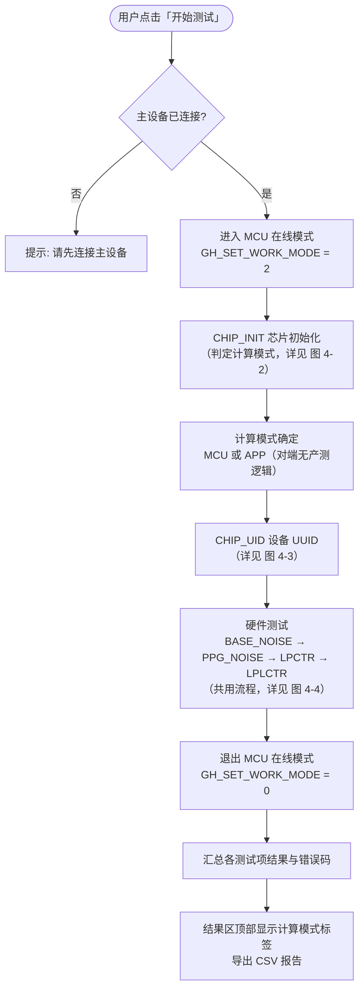
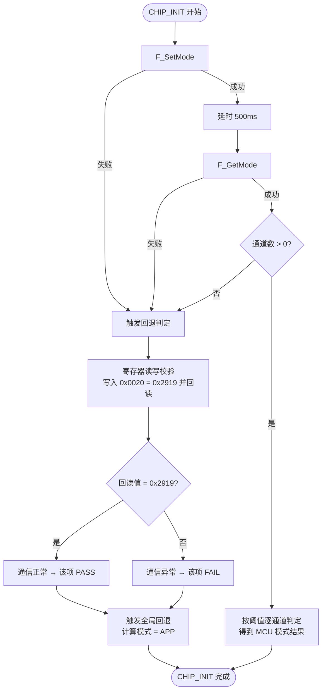
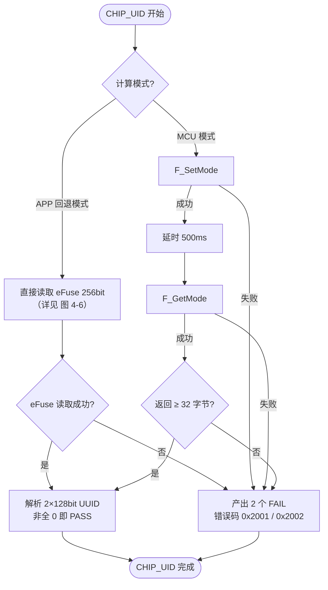
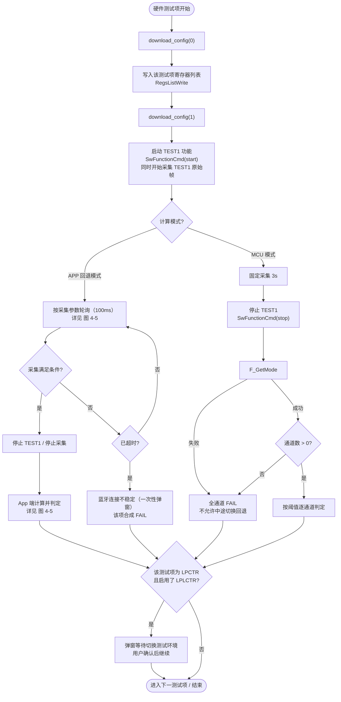
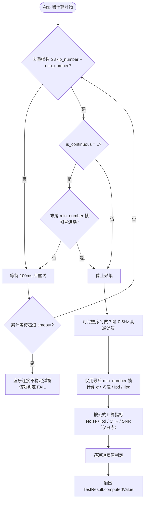
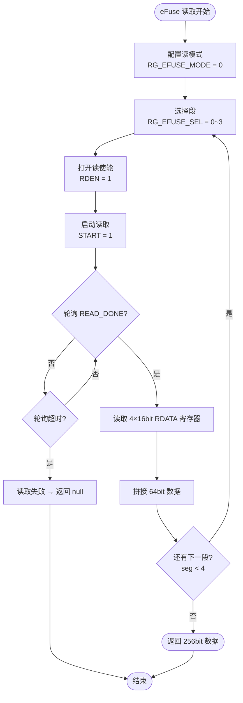

# Feature-Factory 模块流程文档

## 1. 模块概述

`feature-factory` 是产测（工厂测试）模块。加载设备配置文件，按序执行测试用例，收集测试结果并导出 CSV 报告。

## 2. 核心组件

| 组件 | 文件 | 职责 |
|------|------|------|
| `FactoryViewModel` | `FactoryViewModel.kt` | 测试流程控制、配置加载、结果汇总 |
| `FactoryScreen` | `FactoryScreen.kt` | 产测界面（项目选择、测试执行、结果展示） |
| `factory_config.json` | defaults/factory/config/{chip}/{project}/ | 测试项目配置定义 |
| `.config` 文件 | defaults/factory/config/ | 各测试项的寄存器配置 |

## 3. 配置结构

### 3.1 配置文件位置

```
defaults/factory/config/
├── gh3036/
│   └── L-EVK-T2-GH3038Q/
│       ├── factory_config.json          # 测试项目定义
│       ├── Base_Noise_TEST1_100Hz_0519.config
│       ├── LPCTR_TEST1_100Hz_0519.config
│       ├── LPLCTR_TEST1_100Hz_0519.config
│       └── PPG_Noise_TEST1_100Hz_0519.config
└── gh3220/
    └── HR_SPO2_NADT_ADT_V4200/
        └── HR_SPO2_NADT_ADT_V4200.ini   # 寄存器配置
```

### 3.2 factory_config.json 结构

```json
{
    "tests": [
        {
            "name": "BaseNoise",
            "displayName": "底噪测试",
            "configFile": "Base_Noise_TEST1_100Hz_0519.config",
            "params": { ... }
        },
        {
            "name": "PPGNoise",
            "displayName": "PPG噪声测试",
            "configFile": "PPG_Noise_TEST1_100Hz_0519.config",
            "params": { ... }
        }
    ]
}
```

### 3.3 .config 文件格式

寄存器地址-值对（每行一个寄存器）：
```
0x1000=0x01
0x1004=0x1234
0x1008=0x5678
```

## 4. 测试流程

### 4.1 初始化

```
FactoryScreen 加载
  │
  ▼
FactoryViewModel.init()
  │
  ├── 1. 根据芯片类型选择配置目录
  │     └── BlePreferences.effectiveChip → gh3036 / gh3220
  │
  ├── 2. 列出版本目录 (如 L-EVK-T2-GH3038Q/)
  │     └── 从 assets 或下载目录扫描
  │
  └── 3. 加载 factory_config.json
        ├── 解析测试项目列表
        └── 更新 FactoryUiState
```

### 4.2 测试执行

`FactoryViewModel.startTest()` 校验设备连接后调用 `FactoryTestEngine.runTestSequence()` 按固定顺序执行测试；整体流程与子流程如下图所示（重复流程单独绘制）：



> 说明：CHIP_UID 与 4 个硬件测试（BASE_NOISE / PPG_NOISE / LPCTR / LPLCTR）各自复用独立子流程（图 4-3 / 图 4-4），整体流程图只描述执行顺序与入口。计算模式（MCU / APP）在 CHIP_INIT 一次性确定后不再中途切换，切换与异常规则见 4.2.3。

### 4.2.1 App 端计算回退（F_GetMode 无数据）

当 CHIP_INIT 判定对端固件未实现产测计算逻辑（`F_GetMode` 失败或无通道数据）时，App 全局切换到 App 端计算：后续测试使用测试窗口内采集到的 TEST1 原始帧（`ghFrameFlow` 的 `rawdata` / `phyValue` / `agcInfo`）按公式计算指标并判定。非回退模式下硬件测试中途 `F_GetMode` 无数据或命令失败直接判定该项 FAIL，不允许中途切换回退（见 4.2.3）。

**触发条件**：`F_GetMode` 解析出的 U16 通道数组长度为 0（仅 CHIP_INIT 允许触发全局回退；非回退模式下硬件测试 `F_GetMode` 无数据或命令失败直接判定该项 FAIL，不允许中途切换回退）。

**计算公式**（来自「PPG数据采集通用公式与配置说明」）：

- Noise（μV）= `σ_filter / full_scale × V_ref × 10^6`，`σ_filter` 为 7 阶 0.5Hz 高通滤波后数据的总体标准差
- Ipd（nA）= `(rawdata_avg - offset) / full_scale × V_ref × 10^6 / (tia_ratio × G_k)`，帧内存在 `Ipd_pa` 时优先用（GH3036 帧提供）
- CTR（nA/mA）= `Ipd / Iled`；`Iled`：GH3036 系优先取 AGC 帧 `led_current_sum`(0.1mA)/10（`compute.led_current_ma` 仅回退）；GH3220/GH3300 优先取 `compute.led_current_ma`（AGC 位域未文档化，仅回退并记录 WARN）
- SNR（dB）= `20·log10((rawdata_avg - offset) / σ_filter)`（仅日志展示）

**芯片参数**：`full_scale=2^23`、`vref=1.8V`、`tia_ratio=2` 为全系通用；`offset`：GH3036 为 0，GH3220/GH3300 为 2^23。

**配置字段**（`factory_config.json` 各测试项 `compute` 块，均选填）：

| 字段 | 类型 | 默认 | 说明 |
|------|------|------|------|
| `gain_k` | number | 无 | 跨阻增益 kΩ；帧内无 Ipd pA 且需 rawdata 法计算时必需（不限芯片） |
| `led_current_ma` | number | 无 | LED 电流 mA，缺省从 AGC 帧读取 |
| `sample_rate_hz` | number | 100 | 采样率，用于 0.5Hz 高通滤波系数 |
| `min_number` | number | 100 | App 端计算最少帧数（计算窗口 = 最后 min_number 帧）；有效帧数不足时该项 FAIL |
| `skip_number` | number | 噪声 200 / CTR 0 | 跳过帧数（预热），总帧数 = skip_number + min_number |
| `is_continuous` | number | 噪声 1 / CTR 0 | 1=要求末尾 min_number 帧帧号连续；0=不要求 |
| `timeout` | number | 10000 | 采集超时 ms；超时未满足条件提示蓝牙连接不稳定并判定 FAIL |

**采集策略（仅 App 端计算回退路径）**：回退模式下按 `compute` 块参数轮询采集 TEST1 原始帧（100ms 间隔），去重帧数达到 `skip_number + min_number` 即停止采集；`is_continuous=1` 时还要求末尾 `min_number` 帧帧号连续。超时未满足条件时输出 ERROR 日志「蓝牙连接不稳定…本项判定 FAIL」、该测试项直接 FAIL，并弹出一次性对话框提示（不影响测试流程）。非回退路径仍为固定 3s 采集窗口。噪声计算对完整序列做 0.5Hz 高通滤波、σ 只统计最后 `min_number` 帧。

计算值以 `TestResult.computedValue` 输出到界面与 CSV；单通道无原始数据时该通道标记 FAIL 并记录 WARN 日志；整个测试窗口未采集到任何原始数据时记录 ERROR 日志并产出 1 个合成 FAIL 结果（`value=0`），整次产测判定 FAIL，不再误判 PASS。

**CHIP_INIT（芯片初始化）**：`F_GetMode` 无数据时改为寄存器读写校验通信——写入 `{0x0020, 0x2919}`（FIFO_WATER_LINE:25, RG_FIFO_READ_INT_TIMER:0.4s，取自 GH3036 产测配置）并回读，一致则 PASS（通信正常），写入/读取失败或回读不一致则 FAIL；校验寄存器为引擎常量（`CHIP_COMM_CHECK_REG_ADDR` / `CHIP_COMM_CHECK_REG_VALUE`），其它芯片如需调整可修改常量。

**CHIP_UID（设备UUID）**：回退模式下 `F_GetMode` 无数据或不足 32 字节时，改用上位机寄存器指令读取 eFuse——按 SDK `gh_efuse_read_single` 流程依次配置 RG_EFUSE_MODE/SEL、打开 RDEN、启动 START、轮询 READ_DONE、读取 4 个 RDATA 寄存器并拼装 64bit，共读 4 段（256bit）拼装 32 字节导出两个 128bit UUID；仅 GH3036 系列芯片支持该回退，eFuse 读取失败或非 GH3036 系列时产出 2 个 FAIL 结果（错误码 0x2001/0x2002），整次产测判 FAIL。

**全局回退**：CHIP_INIT 流程出现 `F_SetMode`/`F_GetMode` 失败或 `F_GetMode` 无数据时（对端无产测逻辑），后续全部测试（CHIP_UID、BASE_NOISE、PPG_NOISE、LPCTR、LPLCTR）直接使用 App 端计算，不再尝试 `F_SetMode`/`F_GetMode`；硬件测试仍执行 `download_config` 与 TEST1 原始帧采集作为 App 端计算输入。非回退模式下各测试使用设备返回数据：硬件测试中途 `F_GetMode` 无数据或命令失败、CHIP_UID 中途 `F_SetMode`/`F_GetMode` 失败或返回不足 32 字节，均直接判定该项 FAIL，不允许中途切换回退。结果区顶部显示「计算模式：MCU / APP（对端无产测逻辑）」全局标签（由 CHIP_INIT 判定结果决定，每次运行只显示一种）。

**SNR**：`PpgMetricsCalculator.snr` 已实现（`20·log10((rawdata_avg - offset)/σ_filter)`），App 端计算在 PPG_NOISE/BASE_NOISE 通道输出 `Noise=...μV SNR=...dB` 日志；SNR 暂不参与产测判定，后续有实际计划再接入接口。

### 4.2.2 子流程图（重复流程单独绘制）

#### 图 4-2：CHIP_INIT 与计算模式判定



> CHIP_INIT 是唯一允许触发「MCU → APP」切换的测试项；只要进入回退判定即全局切换为 App 端计算（寄存器校验结果只决定该项 PASS/FAIL，不影响切换）。

#### 图 4-3：CHIP_UID 流程



> MCU 模式下 `F_SetMode` / `F_GetMode` 失败或返回不足 32 字节时直接产出 2 个 FAIL，不再中途回退读取 eFuse。

#### 图 4-4：硬件测试通用流程（BASE_NOISE / PPG_NOISE / LPCTR / LPLCTR 共用）



#### 图 4-5：App 端计算与采集策略



#### 图 4-6：eFuse 读取流程（回退模式 CHIP_UID 使用）



> eFuse 流程对应 SDK `gh_efuse_read_single`：每段 64bit，共读 4 段拼装 256bit，导出两个 128bit UUID；仅 GH3036 系列芯片支持，其余芯片读取失败直接产出 2 个 FAIL。

### 4.2.3 流程切换说明

| 切换 | 触发条件 | 行为 | 说明 |
|------|----------|------|------|
| MCU → APP（全局回退） | CHIP_INIT 中 `F_SetMode` / `F_GetMode` 失败，或 `F_GetMode` 无通道数据 | 计算模式 = APP，结果区标签显示「计算模式：APP（对端无产测逻辑）」 | 唯一允许的切换点；后续 CHIP_UID 与全部硬件测试直接用 App 端计算，不再尝试 `F_SetMode` / `F_GetMode` |
| 环境切换（LPCTR → LPLCTR） | LPCTR 完成且启用了 LPLCTR | 弹窗「请切换测试环境」，用户确认后继续 | 流程暂停等待，不影响测试结果 |
| 中途异常（非回退模式） | 硬件测试 `F_GetMode` 失败/无通道；CHIP_UID `F_SetMode` / `F_GetMode` 失败或返回不足 32 字节 | 该项直接 FAIL | 不允许中途切换回退 |
| 采集超时（App 模式） | 采集未满足条件且超过 `timeout` | 一次性弹窗「蓝牙连接不稳定」+ 该项 FAIL | 测试继续执行，不影响后续测试项 |

**计算模式标签**：结果区顶部显示「计算模式：MCU」或「计算模式：APP（对端无产测逻辑）」，由 CHIP_INIT 判定结果决定，每次运行只显示一种。`FactoryTestEngine` 在 CHIP_INIT 后发出一次 `ComputationMode` 事件，`FactoryViewModel` 写入 `FactoryUiState.computeMode`，`startTest` 开始时重置为 null（未判定前不显示标签）。

### 4.3 日志记录

```
FactoryViewModel 测试过程中
  │
  ├── 关键步骤 → testLogs 列表
  │     ├── "开始写入配置: 0x1000=0x01"
  │     ├── "写入完成，共 15 条"
  │     └── "测试结果: 底噪=0.023 (通过)"
  │
  └── LogManager 记录到文件
```

## 5. FactoryUiState

```kotlin
data class FactoryUiState(
    val selectedChip: DeviceType,
    val configVersions: List<String>,
    val selectedVersion: String?,
    val testItems: List<TestItem>,
    val currentTest: String?,
    val testProgress: Float,
    val testResults: Map<String, TestResult>,
    val testLogs: List<String>,
    val isRunning: Boolean,
    val isAllPassed: Boolean?
)

data class TestItem(
    val name: String,
    val displayName: String,
    val enabled: Boolean
)

data class TestResult(
    val name: String,
    val passed: Boolean,
    val value: Float?,
    val threshold: Float?,
    val unit: String
)
```

## 6. CSV 导出

```
FactoryScreen 导出按钮
  │
  ▼
FactoryViewModel.exportResults()
  │
  ├── 生成 CSV 文件
  │     ├── 列: TestName, Result, Value, Threshold, Unit, Timestamp
  │     └── 行: 每个测试项一行
  │
  ├── 保存路径
  │     └── factory/result_{chip}_{version}_{timestamp}.csv
  │
  └── 通过 StoragePath 管理
```

## 7. 错误处理

| 场景 | 处理方式 |
|------|----------|
| 设备未连接 | 提示"请先连接主设备" |
| 配置文件不存在 | 提示错误，跳过该测试 |
| 寄存器写入失败 | 记录日志，标记测试失败 |
| 测试超时 | 设置超时 (如 30s)，超时后标记失败 |
| 数值超出阈值 | 标记 FAIL + 高亮显示 |

## 8. 资源文件部署

默认配置源目录为仓库根 `defaults/`（`app/build.gradle.kts` 注册为 assets 源目录，自动打包进 APK）：
- `application/config/{chip}/*.config|ini`：芯片级默认应用配置
- `factory/config/{chip}/{project-name}/*.config|ini|json`：产测默认配置

应用启动时 `DefaultConfigInstaller`（core-storage）把 APK assets 中的 `application/config`、`factory/config`
解压到 `GHealthTools/application/config/`、`GHealthTools/factory/config/`，已存在文件跳过（不覆盖用户配置）。
新增默认配置只需按上述格式放入 `defaults/` 即可。